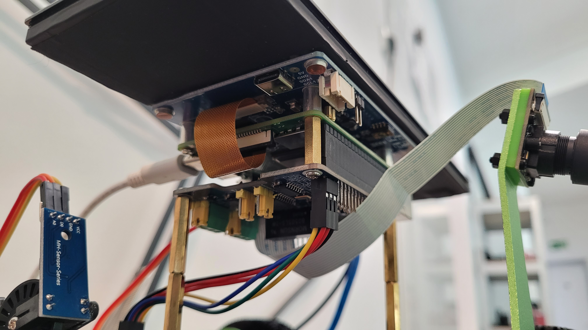
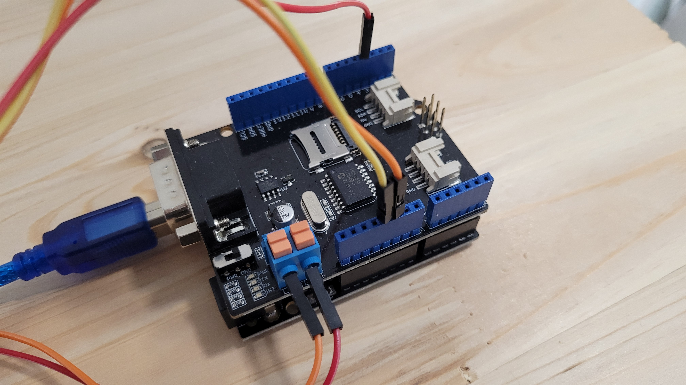
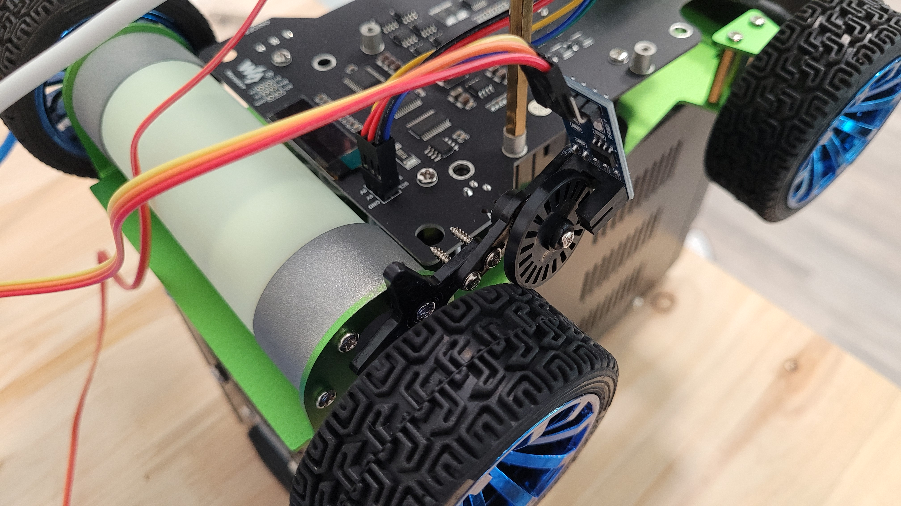
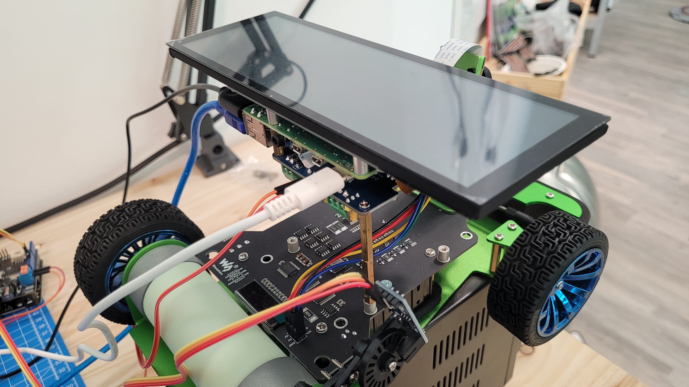
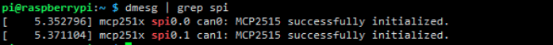

# Setting

---

# PiRacer Hardware & Software Setting Guide

This document provides a guide to basic setup and configuration of PiRacer’s hardware and software. All contents of this project have been tested in an environment based on the components specified below.

# Requirements

Before starting this guide, you will need the following components:

1. PiRacer AI Kit (PiRacer Standard)
2. Raspberry Pi 4B
3. 2-Channel CAN-BUS(FD) Shield for Raspberry Pi (MCP2518FD)
4. Arduino UNO
5. CAN-BUS Shield V2.0 (MCP2515)
6. 7.9inch DSI LCD (400 x 1280, 60Hz)
7. Speed Sensor (LM393)

# Hardware Setting

1. To assemble the PiRacer's main body, check this [GitHub page]() for the detailed assembly process. You can also refer to the following official [waveshare guide](https://www.waveshare.com/wiki/PiRacer_Assembly_Manual).
2. Install the CAN-BUS shield on top of the Raspberry Pi and the LCD at the bottom. The wires of PiRacer's camera and LCD must be connected to the body of Raspberry Pi. Fix the LCD screen to the PiRacer with the standoff part so that it faces upward.



3. Combine Arduino Uno and CAN-BUS Shield. Connect the CAN_H and CAN_L to the corresponding locations of the CAN-BUS shield on the Raspberry Pi, respectively.



4. Carefully refer to the picture and fix the speed sensor to the rear wheel of the PiRacer body. Fix the rotating part of the speed sensor so that it is engaged with the tire and rotates together. Frames used to assemble the speed sensor can be found in the components provided in the PiRacer kit.



5. Connect the Raspberry Pi to the piracer's servo using 6pin gpio and connect all the necessary wires. Check Raspberry Pi and piracer's GPIO map.



6. Finally, insert the Micro SD card into the Raspberry Pi to complete the assembly.

## Precautions

- All assembly procedures should be done with the power off to avoid electric shock.
- Please assemble the components with care. Incorrect assembly could damage the components.
- Please keep the components safe and turn off the power when not in use.

---

# Software Setting

## Basic setting in Rasbian

Tested on the following distributions:

- Rasbian Lite(Server) 64-Bit : latest version but update raspi-firmware version 5.15.84

### Download Raspbian

: **[Rpi-Imager](https://www.raspberrypi.com/software/)**

You can download Raspberry Pi Imager in link. You can choose raspbian version in imager. We choose Rasbian Lite 64-Bit.

Among the parts to be careful of, the USB erase function in Imager cannot initialize the file system, so you need to download the OS from Imager after initializing the USB with a program that initializes the file system.

### **Update the Raspberrypi Firmware**

[Rpi-Firmware](https://github.com/raspberrypi/rpi-firmware)

When update firmware, you need to choose stable version. We choose 5.15.84. You can check the version in commits.

```bash
sudo apt-get update
sudo apt-get dist-upgrade
sudo reboot
sudo rpi-update (firmware_version commit full SHA)
sudo reboot
```

### Install Dependencies

```bash
sudo apt update
    sudo apt install \
        gcc \
        v4l-utils \
        i2c-tools \
        raspi-config \
        python3-dev \
        python3-setuptools \
        libopencv-dev \
        python3-pip \
    sudo apt upgrade
    sudo reboot
```

### Enable i2c and camera

Use the **raspi-config** tool to enable the following peripherals:

- i2c: Interface Options > I2C
- Camera: Interface Options > Camera

Afterwards, reboot:

```bash
sudo reboot
```

### Install libraries
* bcm2835

Open the terminal and run the commands below to install the bcm2835 library:

```bash
wget http://www.airspayce.com/mikem/bcm2835/bcm2835-1.60.tar.gz
tar zxvf bcm2835-1.60.tar.gz 
cd bcm2835-1.60/
sudo ./configure
sudo make
sudo make check
sudo make install
# For More：http://www.airspayce.com/mikem/bcm2835/
```

* wiringPi

```bash
#Open the Raspberry Pi terminal and run the following command
cd
sudo apt-get install wiringpi
#For Raspberry Pi systems after May 2019 (earlier than that can be executed without), an upgrade may be required:
wget https://project-downloads.drogon.net/wiringpi-latest.deb
sudo dpkg -i wiringpi-latest.deb
gpio -v
# Run gpio -v and version 2.52 will appear, if it doesn't it means there was an installation error

# Bullseye branch system using the following command:
git clone https://github.com/WiringPi/WiringPi
cd WiringPi
. /build
sudo gpio -v
# Run gpio -v and version 2.70 will appear, if it doesn't it means there was an installation error
```

* Python

Install python library:

```bash
#python3
sudo apt-get update
sudo apt-get install python3-pip
sudo apt-get install python3-pil
sudo apt-get install python3-numpy
sudo pip3 install RPi.GPIO
sudo pip3 install spidev 
sudo pip3 install python-can
```

### Preparation
* Insert the module into Raspberry Pi, and then modify the config.txt file:

```bash
sudo nano /boot/config.txt
```

* Append these statements to the file:

```bash
dtparam=spi=on
dtoverlay=mcp2515-can1,oscillator=16000000,interrupt=25
dtoverlay=mcp2515-can0,oscillator=16000000,interrupt=23
dtoverlay=spi-bcm2835-overlay
dtparam=spi=on
dtoverlay=spi1-3cs
dtoverlay=mcp251xfd,spi0-0,interrupt=25
dtoverlay=mcp251xfd,spi1-0,interrupt=24
```

* Save and exit, then restart your Pi:
```bash
sudo reboot
```

* After restart, check if initialize successfully:
```bash
sudo dmesg | grep spi
```




* Set up CAN:
```bash
sudo ip link set can0 up type can bitrate 500000
sudo ip link set can1 up type can bitrate 500000
sudo ifconfig can0 txqueuelen 65536
sudo ifconfig can1 txqueuelen 65536
```

* For more information about CAN kernel instructions, please check:
```bash
# https://www.kernel.org/doc/Documentation/networking/can.txt
```

## Install Piracer-py package

```bash
    pip install piracer-py
```

For details, follow this [link](https://github.com/twyleg/piracer_py)

We didn't use virtual environment because of the PATH issues.

## Install D-Bus packages

To compile python dbus, you have to install :

```bash
sudo apt-get install python3
sudo apt-get install python3-pip
pip3 install dbus-python
sudo apt-get install libglib2.0-dev
sudo apt-get install python3-gi
```

To compile C dbus, you have to install :

```bash
sudo apt-get update
sudo apt-get install gcc
sudo apt-get install libdbus-1-dev
```

You can test sample code in [dbus_tutorial](../../dbus_tutorial/)

## Install waveshare 7.9inch DSI LCD Driver

```bash
#Step 1: Download and enter the Waveshare-DSI-LCD driver folder
git clone https://github.com/waveshare/Waveshare-DSI-LCD
cd Waveshare-DSI-LCD
 
#Step 2: Enter uname -a in the terminal to view the kernel version and cd to the corresponding file directory
#6.1.21 then run the following command
cd 5.15.84
 
#Step 3: Please check the bits of your system, enter the 32 directory for 32-bit systems, and enter the 64 directory for 64-bit systems
cd 64
#cd 32
 
#Step 4: Enter your corresponding model command to install the driver, pay attention to the selection of the I2C DIP switch
#7.9inch DSI LCD 400×1280 driver：
sudo bash ./WS_xinchDSI_MAIN.sh 79 I2C0
 
#Step 5: Wait for a few seconds, when the driver installation is complete and no error is prompted, restart and load the DSI driver and it can be used normally
sudo reboot
```

## Install packages for cross-compile & Qt

Install some required packages for run Qt

```bash
sudo apt-get build-dep qt5-qmake
sudo apt-get build-dep libqt5gui5
sudo apt-get build-dep libqt5webengine-data
sudo apt-get build-dep libqt5webkit5
sudo apt-get install libudev-dev libinput-dev libts-dev libxcb-xinerama0-dev libxcb-xinerama0 gdbserver
```

The executable file we uploaded is an executable file that has already been cross-compiled for the target machine.

Nevertheless, if you want to try cross-compilation for various tests, please follow [crosscompile](../crosscompile/).